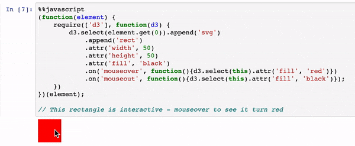

# D3 JavaScript visualisation in a Python Jupyter notebook

Written by Olivia Vane, February 7, 2020

[Jupyter notebooks](https://jupyter.org/) are a great environment for bringing together code with the outputs of processing, including visualisations. They’re becoming increasingly popular in cultural heritage data/digital humanities work. Tim Sherratt’s [GLAM Workbench](https://glam-workbench.github.io/), for example, uses Jupyter notebooks to interweave data processing and analysis with visualisations and commentary. In Living with Machines we’ve found ourselves using Jupyter notebooks widely, largely in Python.

In this post, I explain why we needed to use the JavaScript visualisation library [D3](https://d3js.org/) in a Python Notebook, and share the steps I took to get it working for our specific goals.

There are a number of Python libraries for doing visualisation eg. the classic [Matplotlib](https://matplotlib.org/) and, with chart interactivity nicely built in with Jupyter, [Altair](https://altair-viz.github.io/), [Bokeh](https://bokeh.org/), and [Plotly](https://plot.ly/python/). But you may find you need more customisation in your visualisation design than these libraries support. 

[D3](https://d3js.org/) is a low-level JavaScript visualisation library: you’ll write more code, but it has an ‘[expressivity advantage](https://vega.github.io/vega/about/vega-and-d3/)’. Can you put a D3 JavaScript visualisation into a Python Jupyter notebook? Yes! (Though there are some hacky bits). Before I go on to how, I’ll explain why we ended up looking into this in the first place.

## Why we wanted to do this

We were using a Jupyter notebook to narrow down a large dataset of historical newspaper titles held by the British Library (here a newspaper title means eg. The Times or The Blackpool Herald) for digitisation using a range of criteria. After filtering our dataset, we created a visualisation overviewing the remaining data to support selecting titles for digitisation. You can read more about this tool, Press Picker, in [this post](https://livingwithmachines.ac.uk/press-picker-visualising-formats-and-title-name-changes-in-the-british-librarys-newspaper-holdings/). We initially created a static Matplotlib plot, but found we wanted:

- more control and customisation in the visual design to communicate the complexity of our data, including interactive tooltips (additional text that appears when elements are hovered over)
- to use the visualisation as a selection interface. Creating it in JavaScript meant we could add selection boxes as part of the visualisation.

We, therefore, looked into extending the design in D3. I found [this blog post](https://www.stefaanlippens.net/jupyter-custom-d3-visualization.html) by Stefaan Lippens the most helpful for figuring out what to do and I’d recommend giving it a read. What I’ve put below repeats some of Stefaan’s post, adds some reflections, and notes where we did things a little differently or for different reasons.

There’s an accompanying Jupyter notebook to this blog post which demonstrates the steps below. The [code is on Github](https://github.com/Living-with-machines/D3_JS_viz_in_a_Python_Jupyter_notebook) and you can [try the notebook live on Binder](https://mybinder.org/v2/gh/Living-with-machines/D3_JS_viz_in_a_Python_Jupyter_notebook/master?filepath=D3_JS_viz_in_a_Python_Jupyter_notebook.ipynb).

## JavaScript in a Python Jupyter notebook cell

You can run JavaScript in a Python Jupyter cell simply by writing

    
    %%javascript
    [some JavaScript]
    

 You can also do it by importing the IPython library:

    
    from IPython.display import Javascript
    

And then run JavaScript like this:

    
    Javascript("""
    [some JavaScript]
    """)
    

Or run an external JavaScript file like this (we’ll return to this approach below):

    
    Javascript(filename='someFileName.js')
    

## Importing JavaScript libraries (in this case D3) 

To import D3, use [RequireJS](https://requirejs.org/) which handily comes already baked into Jupyter notebooks. (NB. This approach will not work in [Google Colab](https://colab.research.google.com/) as it does not include RequireJS):

    
    %%javascript
    require.config({ 
         paths: { 
         d3: 'https://d3js.org/d3.v5.min'
    }});
    

(Note the path should NOT include the ‘.js’ file extension).

To then use D3 in subsequent cells, you again use RequireJS:

    
    %%javascript
    require(['d3'], function(d3) {   
         console.log(d3);
    });
    

## Accessing the output cell

Running JavaScript, you don’t automatically get anything appearing in the output cell. `element` is the jQuery powered wrapper for the current output cell:

    
    %%javascript
    element.text('hello world');
    

`element.get(0)` is the DOM ([Document Object Model](https://www.w3schools.com/js/js_htmldom.asp)) node that can be handed to `d3.select()`. Since `element` is a global variable and overwritten when new cells are run, to make sure you’re referring to the correct output cell wrap this in a [closure](https://www.w3schools.com/js/js_function_closures.asp) like so:

    
    %%javascript
     (function(element) {
         require(['d3'], function(d3) {   
            d3.select(element.get(0)).append('text').text('hello world');
         })
     })(element);
    

We’ve used D3 in a Python Jupyter notebook!

## Getting your data into JavaScript

To get your data into D3, it needs to be in a [format that D3 accepts](https://github.com/d3/d3-fetch/tree/v1.1.2). One option is to create a json formatted string using `json.dumps(data)`. As so:

Import the json module:

    
    import json
    

Create a Python list:

    
    data = [50, 100]
    

Convert the Python list to a json formatted string and pass it into JavaScript:

    
    Javascript("""
    console.log(%s);
    """ % json.dumps(data))
    

(The triple quotes allows a multi-line string in Python. I’m using [this](https://matthew-brett.github.io/teaching/string_formatting.html#option-3-old-school-formatting) Python string formatting method here).

In our case, we were using the popular Python library [Pandas](https://pandas.pydata.org/) for data analysis and manipulation and wanted to visualise data from a Pandas DataFrame (df). We decided to export the df to an external json file (in the same directory as our Jupyter notebook) which we then reference in our subsequent JavaScript code.

In Python space, save your Pandas dataframe as a json file

    
    df.to_json(r'df.json', orient="records")
    

This json file can then be referenced by name in a JavaScript cell:

    
    %%javascript
    ...
    d3.json("df.json")
    

(See the [accompanying notebook](https://mybinder.org/v2/gh/Living-with-machines/D3_JS_viz_in_a_Python_Jupyter_notebook/master?filepath=D3_JS_viz_in_a_Python_Jupyter_notebook.ipynb) for a fuller example of this).

This approach is also neat if you choose to keep your JavaScript in an external file that you load in, and can thus just reference the data file by filename there.

## Creating a D3 visualisation in a Jupyter cell

You’ll likely want to create your visualisation code in a standalone HTML page first and do all your debugging there. Debugging JavaScript in a Jupyter notebook is not great (there’s lots of stuff already going on in the DOM structure and error messaging, code formatting is nicer in a proper code editor, and I also found Jupyter temperamental for forcing a hard refresh when I was updating the code). Once your visualisation is ready as a standalone, it’s straightforward to copy your code across, just editing a few minor things for the Jupyter environment.

## Putting visualisation code in external files

[Stefaan](https://www.stefaanlippens.net/jupyter-custom-d3-visualization.html) proposes putting your visualisation code in a separate file as a way to create a reusable visualisation module. In our case, we decided to do this because our JavaScript code was long and unwieldy and looked off-putting for people using the notebook to select titles. 

You can neatly load in external css and js files for your visualisation into Jupyter like this:

    
    display(HTML(filename="viz.css.html"))
    Javascript(filename='viz.js')
    

In `viz.css.html` wrap the css in `
    

(You can even use custom [Google fonts](https://fonts.google.com/) in your d3 visualisation in Jupyter.  Place any font [embed links](https://developers.google.com/fonts/docs/getting_started)  in this `viz.css.html` file above the `<style>` tags, and you can then apply fonts to elements the normal way with css).

In `viz.js` [define a module](https://requirejs.org/docs/api.html#define) which has d3 as a dependency. The module, here called `viz`, returns a function with argument `container` (to append the SVG element to) as its definition.

    
    // contents of viz.js
     define('viz', ['d3'], function (d3) {
         function draw(container) {
            d3.select(container).append("svg").append(… etc.
         }
         return draw;
     });
     // this final line prints a message in the output cell when viz.js is loaded
     element.append('Loaded 😄 ');
    

Back in Jupyter, to create the D3 graphic defined in our module `viz`, use the following:

    
    Javascript("""
     (function(element){
         require(['viz'], function(viz) {
              viz(element.get(0))
         });
     })(element);
     """)
    

## Passing variables across cells between Python and JavaScript

This bit is pretty hacky.

### Python to JavaScript

We were passing a list of IDs from Python into JavaScript to update our visualisation. 

Firstly, you’ll need the `HTML` object from `IPython`:

    
    from IPython.display import HTML
    

Using `HTML`, you can then create a new element in the DOM whose data attribute we set to our variable. 

    
    variable1 = "this_could_be_any_python_string"
    HTML("

")
    

From JavaScript, you can then use `document.getElementById()` to access the data attached to this element.

    
    %%javascript
    var fromPython = document.getElementById('variable1').getAttribute('data-fromPython');
    element.text(fromPython);
    

This method works for Python objects that can be represented as a string and then reinterpreted back once they&#8217;ve been passed into JavaScript, for example a list.

### JavaScript to Python

We had selection boxes as part of our visualisation and needed to access the IDs associated with the selected ones in Python to display the matching records in a Pandas df.

As above, this approach passes a string between languages. You make use of the `kernel` object from `IPython`, which enables a Python statement to be executed from JavaScript:

    
    %%javascript
    var variable2 = "this_could_be_any_javascript_string";
    // command is a string containing Python code
    var command = "fromJavaScript='" + variable2 + "'";
    IPython.notebook.kernel.execute(command);
    

Back in Python space:

    
    print(fromJavaScript)
    

## Is this all a good idea?

Yes, in the right sort of case!

We were able to create a visualisation customised to our needs. And even though our visualisation was very large in size (100,000px in height!), it didn’t slow down the Jupyter notebook.   

But you can see moving data and variables between the two languages is not completely painless. And it’s not the same as the full control you have in designing a D3 visualisation in a normal HTML page. For example, in order to fix a time axis at the top of our chart—so a user can scroll vertically, keeping the axis visible—I ended up having to stick the time axis to the top of the browser window rather than the top of the output cell. This was not ideal as you have to manually position the visualisation Jupyter cell at the top of the page in order for the time axis to be in the right place.

All in all though, it worked well in our case and we’ve successfully used the notebook for the selection task it was designed for.

Looking forward, various people are working on ‘polyglot’ notebooks that support multiple languages. The Alan Turing Institute, in fact, is developing one: [Wrattler](https://github.com/wrattler/wrattler). Down the line, hopefully this kind of thing will be slicker. 